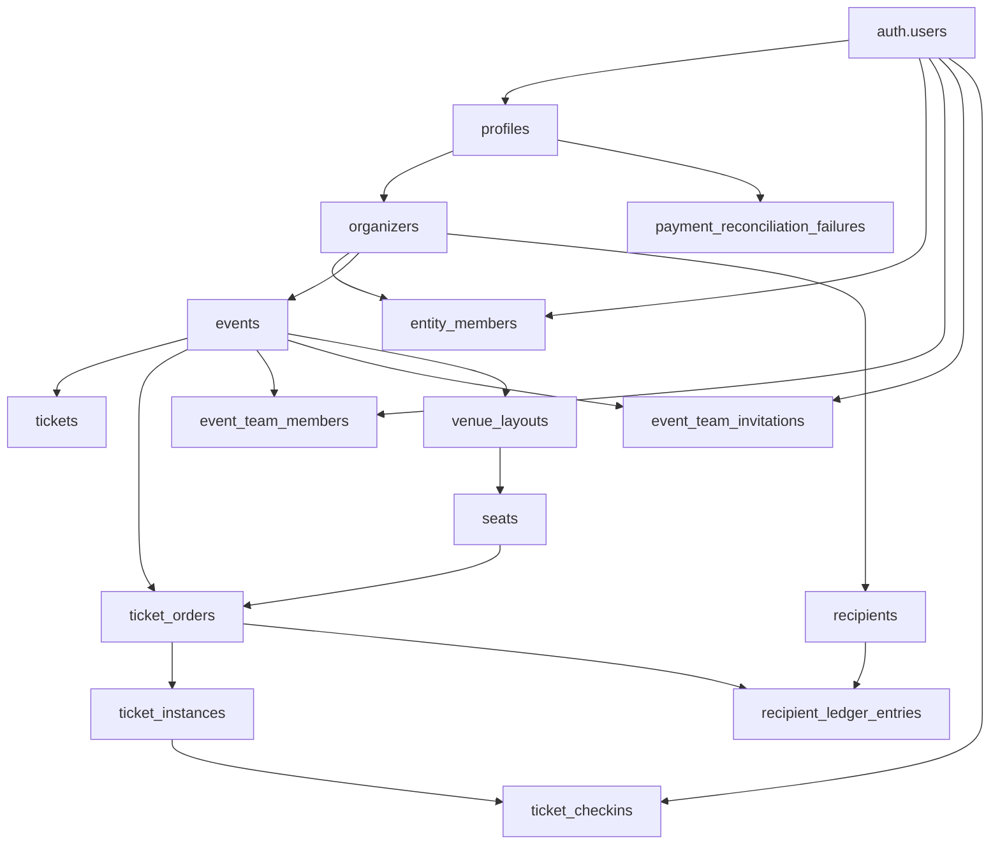

# Events Database Schema

This document covers the schema pieces that matter to Events. It focuses on the data model, the important constraints, and the relationships that drive ticketing, QR verification, check-in, event staff, and payments.

Related docs:

- [Architecture](./architecture.md)
- [Ticket Instances](./ticket-instances.md)
- [QR System](./qr-system.md)
- [Scanner and Check-ins](./scanner-and-checkins.md)
- [Event Team RBAC](./event-team-rbac.md)
- [Payments](./payments.md)
- [Security](./security.md)

## Relationship Map

## Global Identity

### `auth.users`

The app uses Supabase Auth for the underlying identity record. Many of the ownership and membership tables point to `auth.users(id)`.

### `profiles`

`profiles` is the app-level account record.

- Purpose: role, status, preferences, and profile metadata.
- Important columns: `id`, `role`, `status`, `preferences`, `account_info`, `display_name`, `avatar_url`, `deleted_at`, `purge_at` in the current auth helper path.
- Role values: `admin`, `organizer`, `user`.
- Status values: `active`, `suspended`.
- Related code: `lib/auth.ts`, `lib/dashboard-context.ts`.
- RLS: enabled. The current auth helper reads it through a service-role client.

## Organizer and Membership Tables

### `organizers`

- Purpose: organizer profiles that own events and other creator content.
- Primary key: `id`
- Important columns: `user_id`, `name`, `bio`, `photo`, `banner`, `status`, `visibility`, `verified_at`, `organization_name`, `tax_id`, `nonprofit_registration_number`.
- Status values: `pending`, `verified`, `rejected`, `suspended`.
- Relationships:
  - `organizers.user_id` links the organizer owner.
  - `events.organizer_id` links events to organizers.
  - `entity_members.organizer_id` stores delegated organizer access.
- RLS:
  - public read is enabled in the reviewed schema
  - owners can insert, update, and delete their own organizer row
  - platform admins also have access through separate policy logic
- Trigger behavior:
  - `entity_members` seeds an `owner` row when an organizer is inserted.

### `entity_members`

- Purpose: organizer-scoped roles for delegation.
- Primary key: `id`
- Important columns: `organizer_id`, `user_id`, `role`, `invited_by`, `created_at`.
- Role values: `owner`, `admin`, `manager`, `editor`, `finance`, `viewer`.
- Constraints:
  - unique `(organizer_id, user_id)`
  - `organizer_id` and `user_id` both reference `organizers` and `auth.users`
- RLS:
  - self view
  - owner view
  - owner/admin/manager mutation
  - platform admins can read and manage
- Related code: `lib/entity-auth.ts`, `lib/dashboard-context.ts`, `lib/dashboard-api.ts`.

## Event Tables

### `events`

- Purpose: public event listing plus the core event ownership record.
- Primary key: `id`
- Important columns:
  - `title`, `slug`, `description`, `category`
  - `venue`, `city`, `street_address`, `address_locality`, `address_region`, `postal_code`, `address_country`
  - `banner`, `video_url`, `latitude`, `longitude`
  - `event_date`, `end_date`
  - `organizer_id`, `user_id`
  - `visibility`, `status`
  - `source_organizer_name`, `source_organizer_url`, `source_organizer_description`
- Status values: `pending`, `approved`, `rejected`.
- Visibility values: `public`, `private`.
- Relationships:
  - one event can have many `tickets`
  - one event can have many `ticket_orders`
  - one event can have many `ticket_instances`
  - one event can have many team members and invitations
  - one event can have one or more venue layouts
- RLS:
  - public read
  - authenticated insert requires `user_id = auth.uid()`
  - owner update and delete
- Application note:
  - dashboard routes extend access to organizer members and event staff through service-role queries plus shared auth helpers.

### `tickets`

- Purpose: ticket tiers for an event.
- Primary key: `id`
- Important columns: `event_id`, `name`, `price`, `quantity`.
- Relationships:
  - each row is a ticket type used at checkout
  - `ticket_orders.ticket_id` and `ticket_instances.ticket_id` point to the tier selected for the purchase or instance
- RLS:
  - public read and insert were present in the reviewed schema
- Notes:
  - the create-event UI currently supports up to three ticket tiers.

## Order and Instance Tables

### `ticket_orders`

- Purpose: purchase summary and compatibility record.
- Primary key: `id`
- Important columns:
  - `event_id`, `ticket_id`, `seat_id`, `seat_label`
  - `buyer_email`, `buyer_name`
  - `quantity`, `total_amount`, `currency`
  - `qr_code`
  - `status`
  - `stripe_session_id`, `stripe_payment_intent_id`
  - `checked_in_at`
  - `payment_method`
- Status values: `pending`, `valid`, `used`, `cancelled`, `refunded`.
- Relationships:
  - belongs to one event
  - optionally references one seat
  - can be the parent of many `ticket_instances`
  - can be referenced by `ticket_checkins.ticket_order_id` for compatibility/backfill
- Constraints and indexes:
  - primary key on `id`
  - unique `qr_code`
  - unique `stripe_payment_intent_id`
  - index on `event_id`
  - index on `qr_code`
  - index on `stripe_session_id`
- RLS:
  - `ticket_orders` is protected by RLS
  - no explicit end-user policy was found in the reviewed schema export
  - server code accesses it through service-role clients
- Important behavior:
  - new Stripe instance-based purchases use `qr_code = NULL`
  - legacy and direct flows may still populate `qr_code`
  - `status` is still used by some legacy paths, but it is not the authoritative check-in state for instance-based Stripe fulfillment

### `ticket_instances`

- Purpose: one record per admission entitlement.
- Primary key: `id`
- Important columns:
  - `order_id`
  - `event_id`
  - `ticket_id`
  - `seat_id`
  - `seat_label`
  - `qr_code`
  - `status`
  - `checked_in_at`
  - `created_at`, `updated_at`
- Status values: `valid`, `used`, `cancelled`, `refunded`.
- Relationships:
  - each instance belongs to one `ticket_orders` row
  - each instance belongs to one event
  - each instance optionally references one ticket tier and one seat
  - each successful check-in writes a `ticket_checkins` row
- Constraints and indexes:
  - unique `qr_code`
  - index on `order_id`
  - index on `event_id`
  - index on `status`
  - index on `qr_code`
- RLS:
  - buyer email match through the parent order
  - event owner or organizer member
  - active event team member with `event_manager` or `ticket_scanner`
  - platform admin
- Current implementation note:
  - this is the authoritative check-in unit for the current Stripe instance-based flow

### `ticket_checkins`

- Purpose: audit trail for successful check-ins.
- Primary key: `id`
- Important columns:
  - `ticket_instance_id`
  - `ticket_order_id`
  - `event_id`
  - `scanned_by_user_id`
  - `checked_in_at`
  - `created_at`
- Relationships:
  - `ticket_instance_id` points to the used ticket instance
  - `ticket_order_id` is retained for compatibility and reporting
  - `scanned_by_user_id` stores who performed the scan when known
- Constraints and indexes:
  - unique constraint on `ticket_instance_id`
  - index on `ticket_order_id`
  - index on `event_id`
  - index on `scanned_by_user_id`
- RLS:
  - organizers and event managers can read their event check-ins
  - platform admins can read
- Behavior:
  - the current write path inserts one audit row per successfully checked-in ticket instance
  - the table is not relied on as the source of truth for ticket validity; `ticket_instances.status` is

## Event Team Tables

### `event_team_members`

- Purpose: active event staff membership.
- Primary key: `id`
- Important columns:
  - `event_id`
  - `user_id`
  - `role`
  - `status`
  - `invited_by`
  - `invited_at`
  - `accepted_at`
  - `removed_at`
  - `entrance_id`
- Role values: `event_manager`, `ticket_scanner`.
- Status values: `active`, `removed`.
- Constraints:
  - unique `(event_id, user_id)`
  - `event_id` references `events(id)`
  - `user_id` references `auth.users(id)`
- RLS:
  - self read
  - event creator, organizer owner, delegated organizer members, active event managers, and admins can read
  - organizer and event-manager level access can manage rows
- Notes:
  - `entrance_id` exists in the schema as a nullable placeholder, but no current product workflow uses entrance assignment.

### `event_team_invitations`

- Purpose: pending or historical invitations for event staff.
- Primary key: `id`
- Important columns:
  - `event_id`
  - `email`
  - `role`
  - `token`
  - `status`
  - `expires_at`
  - `accepted_at`
  - `invited_by`
  - `entrance_id`
- Role values: `event_manager`, `ticket_scanner`.
- Status values: `pending`, `accepted`, `declined`, `expired`, `revoked`.
- Constraints:
  - token is unique
  - indexes on `event_id` and `(email, status)`
- Security:
  - `token` is not selectable by anon/authenticated roles in the reviewed migration
- RLS:
  - event organizers, event managers, invitees matching the invited email, and admins can read relevant rows
  - organizers and event managers can create/update/delete invitations

## Venue and Seat Tables

### `venue_layouts`

- Purpose: seat-map template for an event.
- Primary key: `id`
- Important columns: `event_id`, `name`, `sections`, `created_at`
- Relationships:
  - one layout can have many `seats`
  - one event can have many layouts
- RLS:
  - enabled in the schema
  - no explicit policy was found in the reviewed migrations or schema export
  - `app/create-event/page.tsx` writes this table directly, so the live database policy surface should be verified before changing the creator flow

### `seats`

- Purpose: individual seats within a layout.
- Primary key: `id`
- Important columns:
  - `layout_id`
  - `event_id`
  - `section`, `row_label`, `seat_number`
  - `status`
  - `reserved_until`
  - `ticket_id`
  - `price_override`
- Status values: `available`, `reserved`, `sold`.
- Constraints:
  - unique `(layout_id, section, row_label, seat_number)`
- Relationships:
  - belongs to one event
  - belongs to one venue layout
  - optionally referenced by `ticket_orders.seat_id`
- RLS:
  - enabled in the schema
  - no explicit policy was found in the reviewed migrations or schema export
  - server routes reserve and release seats through service-role clients

## Payments and Ledger Tables

### `recipients`

- Purpose: internal payout recipient pointer for a user, organizer, or business.
- Primary key: `id`
- Important columns:
  - `recipient_type`
  - `user_id`
  - `organizer_id`
  - `business_id`
  - `created_at`
- Constraints:
  - exactly one identity column must be present
  - unique index per identity column
- RLS:
  - owners and admins can read
  - no direct user-facing mutation path was defined in the reviewed migration
- Notes:
  - `resolve_recipient(...)` is the service-role helper used by payment credit RPCs

### `recipient_ledger_entries`

- Purpose: append-only ledger of credits, debits, refunds, payouts, and adjustments.
- Primary key: `id`
- Important columns:
  - `recipient_id`
  - `entry_type`
  - `amount`
  - `currency`
  - `source_type`
  - `source_id`
  - `external_reference`
  - `description`
  - `created_by`
  - `created_at`
- Constraints:
  - entry type and source type checks
  - amount sign checks by entry type
  - lowercase 3-letter currency format
  - refund entries require an external reference
  - unique dedupe indexes for source entries and refunds
- Triggers:
  - `prevent_ledger_entry_mutation()` blocks UPDATE and DELETE
- RLS:
  - owners and admins can read
  - no user-facing insert/update/delete path
- Notes:
  - this is the canonical immutable payment ledger surface for Events-related credits

### `payment_reconciliation_failures`

- Purpose: records payment-success-but-write-failed cases for manual follow-up.
- Primary key: `id`
- Important columns:
  - `kind`
  - `stripe_payment_intent_id`
  - `amount`
  - `currency`
  - `buyer_email`
  - `raw_metadata`
  - `error_message`
  - `created_at`
  - `resolved_at`
- RLS:
  - admins can read and update
  - service-role webhook writes the table
- Notes:
  - the payment webhook records a failure here and alerts support rather than silently refunding

## Important Functions and Triggers

### `record_ticket_and_credit(...)`

Service-role RPC used by the Stripe ticket webhook.

- Creates one `ticket_orders` row.
- Creates `N` `ticket_instances` rows.
- Writes one `recipient_ledger_entries` credit row.
- Is idempotent for repeated webhook delivery.

### `check_in_ticket(...)`

Service-role RPC used by the scanner and the check-in dashboard.

- Updates one `ticket_instances` row from `valid` to `used`.
- Writes one `ticket_checkins` audit row.
- Rejects already-used, cancelled, refunded, missing, or invalid tickets.

### `refund_ticket_instance(...)`

Service-role RPC for a single instance refund state change.

- Updates one `ticket_instances` row from `valid` to `refunded`.
- Refuses used tickets.
- Does not itself call a payment processor.

### `cascade_ticket_order_status`

Trigger on `ticket_orders` status updates.

- If an order is cancelled or refunded, matching child `ticket_instances` rows in `valid` state are updated too.
- Used instances are intentionally left untouched.

### `trg_seed_organizer_owner_member`

Trigger on `organizers`.

- Seeds an `owner` row in `entity_members`.
- Ensures every organizer has a delegated membership record.

## Access Model Summary

| Table | Main access pattern |
| --- | --- |
| `events` | Public read, owner-authorized writes, service-role dashboard reads. |
| `organizers` | Public read, owner writes, delegated organizer access through `entity_members`. |
| `entity_members` | Owner/admin/member reads, owner/admin/manager writes. |
| `tickets` | Public read and insert in the reviewed schema. |
| `ticket_orders` | Service-role access from application code. |
| `ticket_instances` | Buyer email, organizer, event-team, and admin reads. |
| `ticket_checkins` | Organizer/event-manager/admin reads. |
| `event_team_members` | Staff and organizer scoped reads/writes. |
| `event_team_invitations` | Organizer/team invite and accept flow. |
| `recipient_ledger_entries` | Owner/admin reads only. |
| `payment_reconciliation_failures` | Admin reads and updates only. |

## Verification Notes

- `scratch/test_migration_79.mjs` covers ticket-instance backfill, duplicate check-in protection, and refund behavior.
- `scratch/test_phase3_multi_ticket_checkout.mjs` covers multi-tier order fan-out into instances.
- `scratch/test_phase4_scanner_and_dashboard.mjs` covers instance scanning and check-in analytics.
- `scratch/test_navigation_and_staff_access.mjs` covers organizer and event-staff role scoping.

