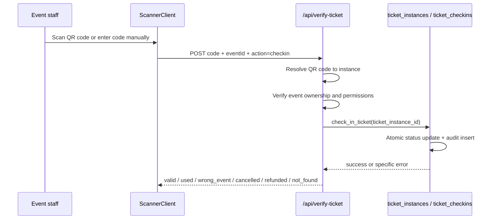

# Scanner and Check-ins

This document covers the full ticket-scanning and check-in flow.

Related docs:

- [Architecture](./architecture.md)
- [Ticket Instances](./ticket-instances.md)
- [QR System](./qr-system.md)
- [Event Team RBAC](./event-team-rbac.md)
- [Database Schema](./database-schema.md)
- [Security](./security.md)

## End-to-End Flow

## Scanner UI

`app/dashboard/events/[id]/scan/ScannerClient.tsx` is the operator-facing scanner.

It does three things:

1. Requests camera access.
2. Uses `jsQR` to decode a QR code from the video stream.
3. Falls back to manual code entry when the camera is unavailable or the operator wants to type the code.

If camera access is denied, the UI still works through manual entry.

## Verification Endpoint

`app/api/verify-ticket/route.ts` is the scanner backend.

### GET

The GET path looks up a QR code and reports whether the ticket is valid. It is useful for inspection or pre-check flows.

### POST

The POST path performs the actual check-in.

Inputs:

- `code`
- `action = "checkin"`
- `eventId`

## Lookup Order

The backend resolves the scanned code in this order:

1. `ticket_instances.qr_code`
2. legacy `ticket_orders.qr_code`

If the code resolves to an instance, that instance is used as the check-in target.

## Authorization

Before a ticket can be checked in, the caller must be signed in and must have event-level permission.

The shared authorization helper allows:

- the event creator
- the organizer owner or delegated organizer member
- an active event team member with `event_manager` or `ticket_scanner` access, depending on the page or route

The scan route re-checks this on the server. Frontend access alone is not enough.

## Event Validation

The scan route verifies that the ticket belongs to the event being scanned.

If the event ID does not match, Aldriva returns a wrong-event result and does not check the ticket in.

## Atomic Check-in

The core concurrency rule is enforced in `db/migration_79_ticket_instances.sql` by `check_in_ticket(...)`.

The function:

1. updates the instance only if `status = 'valid'`
2. returns success only if the update actually changed one row
3. inserts a `ticket_checkins` row for the successful update
4. raises a specific exception if the ticket is missing, already used, cancelled, refunded, or otherwise invalid

That means:

- two simultaneous scans of the same ticket cannot both succeed
- the first scan wins
- the second scan gets an already-used response

## Audit Trail

Every successful scan writes one row to `ticket_checkins`.

Recorded data:

- ticket instance
- ticket order
- event
- scanner user, when available
- check-in timestamp

The audit trail supports:

- scan attribution
- attendance reporting
- history views
- duplicate-check troubleshooting

The current code path appends a row on success. It does not rely on a separate mutable check-in log.

## Result States

The scanner UI and API currently recognize these outcomes:

| State | Meaning |
| --- | --- |
| `valid` | Ticket accepted and checked in. |
| `used` | Ticket was already checked in earlier. |
| `wrong_event` | Ticket belongs to a different event. |
| `cancelled` | Ticket has been cancelled. |
| `refunded` | Ticket has been refunded. |
| `not_found` | The QR code does not match a known ticket. |
| `error` | Something failed during verification. |

## Bulk Attendee Actions

`app/api/dashboard/attendees/bulk/route.ts` reuses the same atomic check-in RPC for the organizer attendee list.

Important current behavior:

- the route is order-centric, not instance-centric
- it resolves one matching ticket instance for each selected order
- it does not have a separate bulk check-in transaction primitive
- atomicity is still preserved per ticket instance, because the same RPC is used

That means bulk check-in should be treated as a convenience layer over the single-ticket RPC, not a separate check-in engine.

## Attendance Dashboard Data

`app/api/events/[id]/checkins/route.ts` is the source for the check-in analytics view.

It calculates:

- total sold
- checked in
- not arrived
- attendance rate
- scanner breakdown
- check-in history

This route is instance-based and is the best place to look when you want actual scan activity.

## Legacy Compatibility

The scanner still understands legacy order QR codes, but the current check-in engine is ticket-instance based.

Treat that compatibility path as historical support, not the preferred model.

## Important Code Locations

| File | Why it matters |
| --- | --- |
| `app/dashboard/events/[id]/scan/ScannerClient.tsx` | Camera scanning, manual entry, and result UI. |
| `app/api/verify-ticket/route.ts` | QR resolution, event validation, and check-in call. |
| `db/migration_79_ticket_instances.sql` | Atomic check-in RPC and check-in audit insert. |
| `db/migration_79c_fix_checkins_constraint.sql` | Adds the unique constraint required for safe conflict handling. |
| `db/migration_79d_fix_check_in_ticket_rpc.sql` | Removes the audit insert conflict handler so duplicate anomalies surface. |
| `db/migration_80e_checkins_order_id_index.sql` | Replaces the legacy unique order index with a non-unique compatibility index. |
| `app/api/events/[id]/checkins/route.ts` | Attendance metrics and scanner breakdown. |
| `app/api/dashboard/attendees/bulk/route.ts` | Bulk attendee actions and instance resolution. |

## Relevant Tests

- `scratch/test_phase4_scanner_and_dashboard.mjs`
- `scratch/test_navigation_and_staff_access.mjs`
- `lib/dashboard/__tests__/event-dashboard-regressions.test.cjs`

